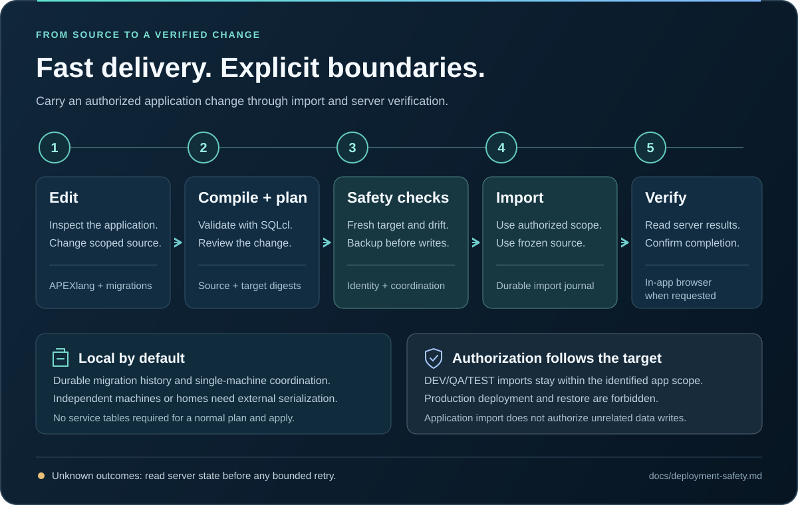

# From source to a verified application

Follow the canonical [Getting started guide](../../docs/getting-started.md) for plugin installation, toolchain setup and your first application. The `$apexrest-work` skill drives one cycle per change:

1. Inspect the project (`apexrest_project`) or create it from a template.
2. Read at most three references (`apexrest_reference`).
3. Edit the `.apx` sources, preserving Oracle IDs and `.apex` metadata.
4. Validate with the real Oracle compiler (`apexrest_apex_validate`) until there are no diagnostics.
5. Plan against the named environment (`apexrest_ship` `mode:plan`) and review risks, sources, target and `importSelection`. For qualified 26.2 apps, choose automatic or explicit partial import; see the [partial-import guide](../../docs/apex-26.2.md).
6. Apply with your explicit request as the authorization (`apexrest_ship` `mode:apply`); backup, identity and drift checks run first.
7. Verify the changed pages in the selected browser (`apexrest_browser_open`).
8. Report what changed, what was verified and what was not.

See [Existing applications](../../docs/existing-app.md), [Deployment safety](../../docs/deployment-safety.md) and [Testing](../../docs/testing.md) for details.
